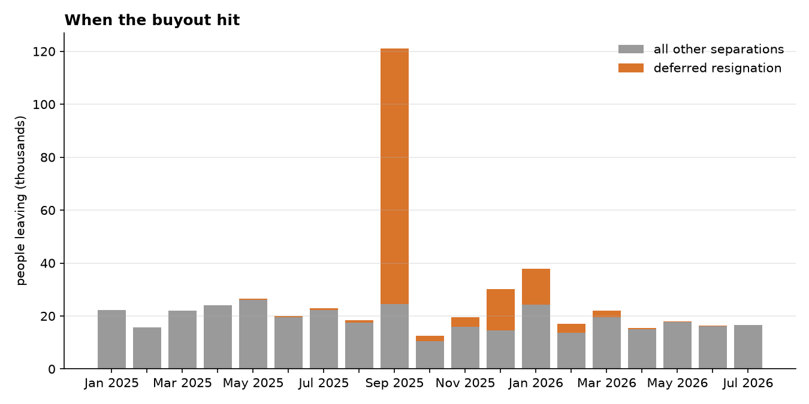
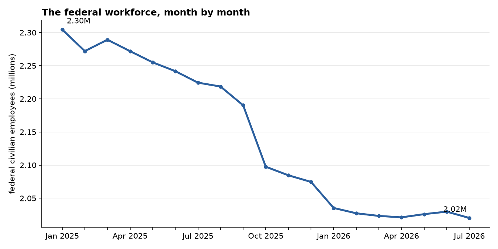
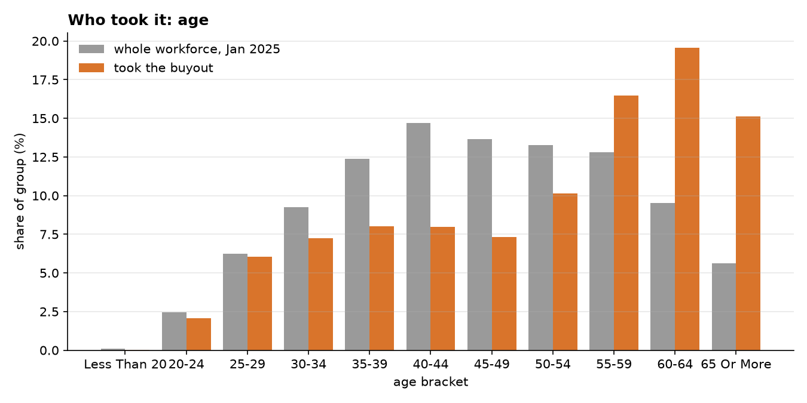
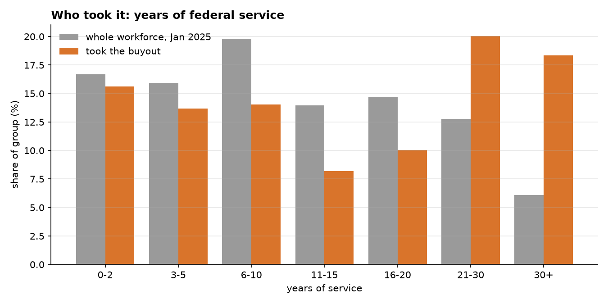
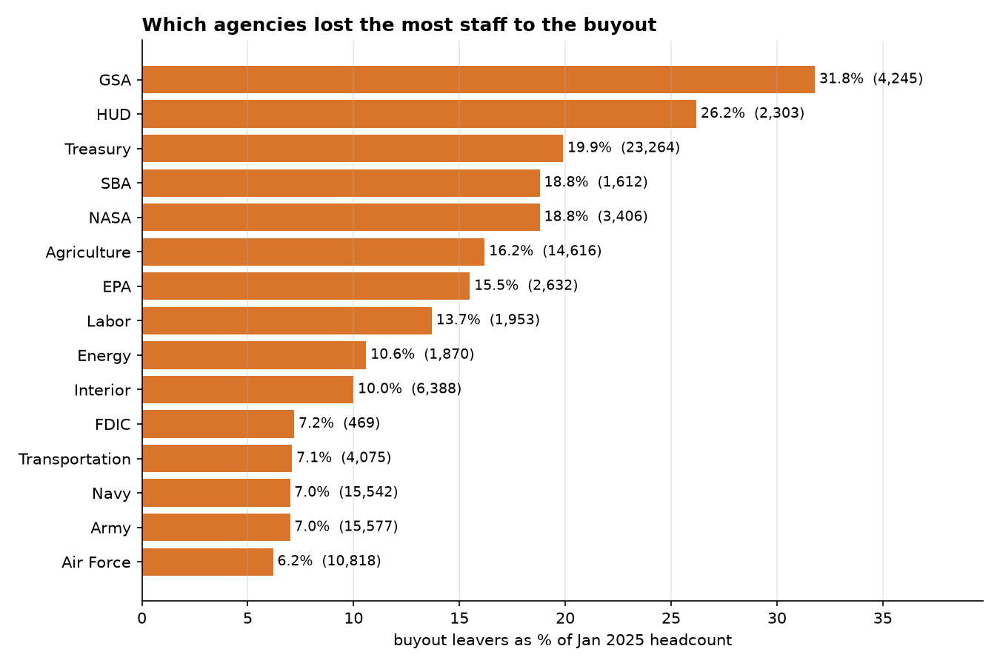
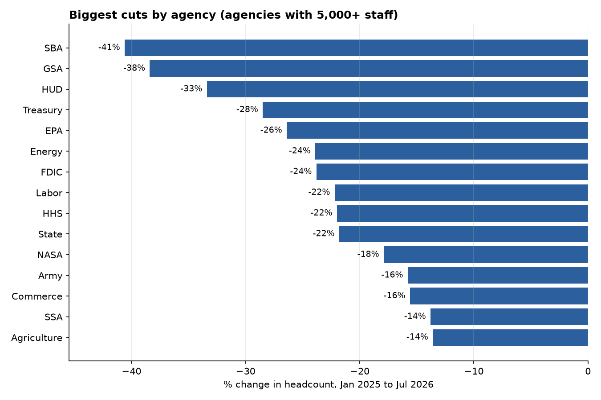
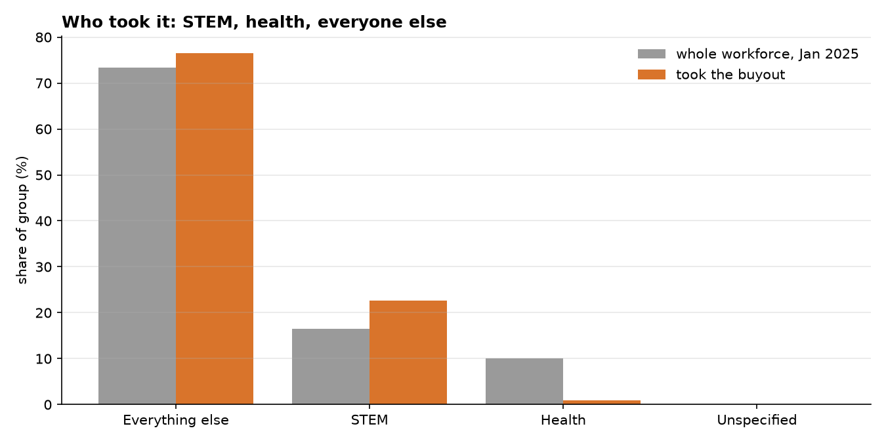
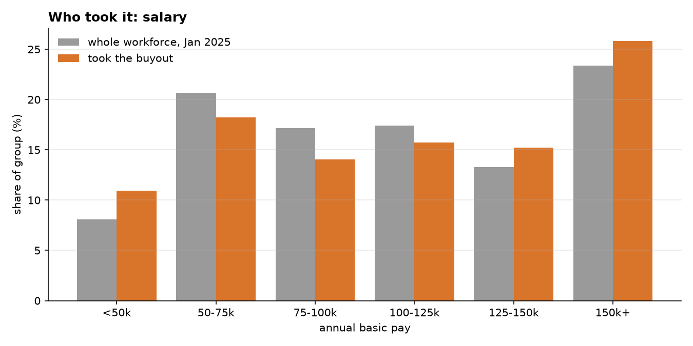

# Who took the federal buyout?

In early 2025 the federal government offered nearly every civilian employee a
deal: resign now, stay on the payroll through September, and skip whatever came
next. OPM's new workforce data site publishes record-level files with a flag
for exactly who accepted. This repo pulls those files and asks who actually
left.

Short answer: the buyout was mostly a retirement wave, concentrated in a
handful of agencies, and it took a lot of institutional memory with it.

## What the data shows

**140,481 people** left under the deferred resignation program between January
2025 and July 2026. That is 6.1 percent of the January 2025 workforce. Nearly
all of them, 96,401, came off the rolls in September 2025, when the paid
period ended. A second, smaller wave of about 29,000 followed in December 2025
and January 2026.



Over the same period the federal civilian workforce fell from 2.30 million to
2.02 million, a drop of 284,000 or 12.3 percent. The buyout explains roughly
half of that.



**It skewed old.** Employees 60 and over were 15 percent of the workforce and
35 percent of buyout leavers. People aged 35 to 49, the middle of a federal
career, took it at about half the rate their numbers would predict.



**It skewed experienced.** Staff with 30 or more years of service were 6
percent of the workforce and 18 percent of leavers, three times their share.
Added up, the people who took the buyout had 2.26 million years of federal
service between them. The median leaver had 14.3 years in.



**A few agencies carried most of it.** GSA lost 32 percent of its January 2025
headcount to the buyout alone. HUD lost 26 percent, Treasury 20 percent
(23,264 people), SBA and NASA 19 percent each. The military departments were
at 6 to 7 percent. DHS and Justice were at 2 and 3 percent.



Counting all departures, not just the buyout, SBA is down 41 percent since
January 2025, GSA 38 percent and HUD 33 percent.



**STEM workers left at a higher rate than everyone else.** They were 17 percent
of the workforce and 23 percent of leavers. Health occupations, which are
mostly at the VA, barely moved: 10 percent of the workforce, under 1 percent of
leavers.



**Pay tells less of a story.** Leavers look a little like the workforce as a
whole, with a slight tilt toward the lowest and highest bands. Pay is redacted
on 45 percent of buyout records, so this one is read with less confidence than
the others.



## Where it comes from

OPM Federal Workforce Data, employment and separations files, January 2025
through July 2026, pulled October 5, 2026. See [METHODS.md](METHODS.md) for
how the comparisons are built and what is redacted or missing.

## Running it

```
python -m venv .venv && source .venv/bin/activate
pip install -r requirements.txt
python src/fetch.py
python src/analysis.py
python src/charts.py
```

The fetch is about 1.3 GB. Summary tables and charts are already in `output/`
if you just want to look.
